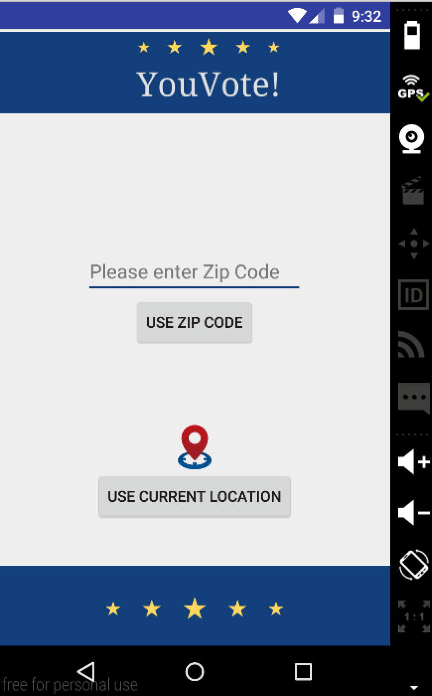
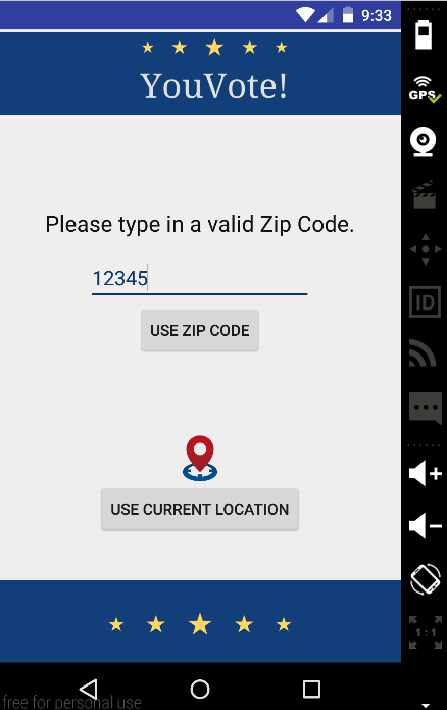
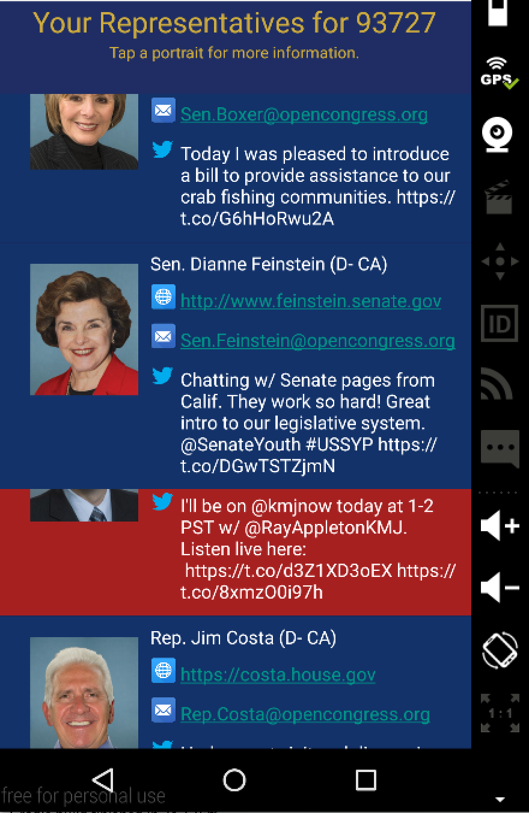
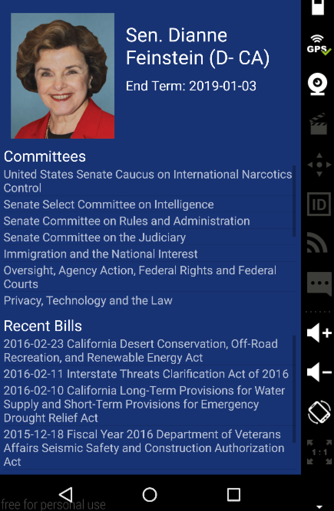
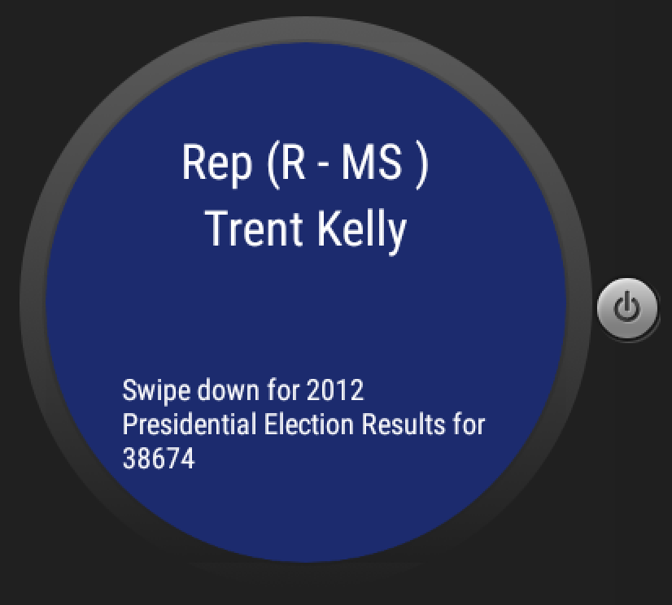
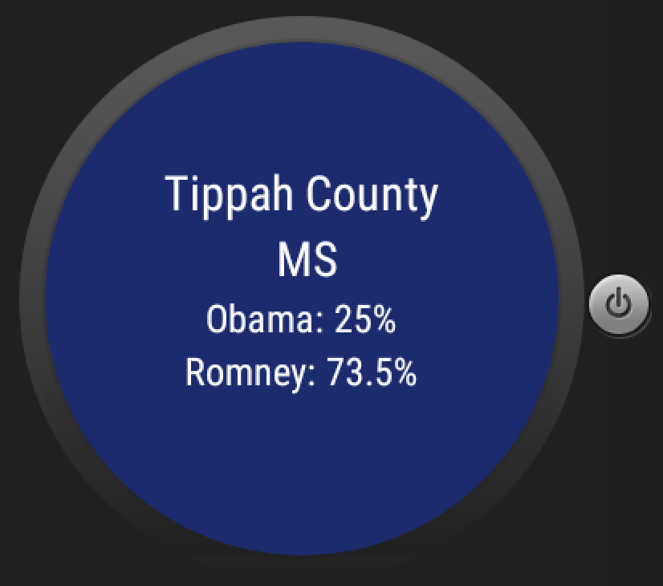

# PROG 02: Represent!

YouVote! is a Android smartphone and smartwatch app that is for informing voters! It informs voters on its elected representatives based on the zip code! It also provides how that particular zip code voted in the 2012 Presidential Election to inform voters on its area's political leaning! So come and try my app out!

## Authors

Derrick Hu ([huderrick@berkeley.edu](mailto:huderrick@berkeley.edu))

## Demo Video

See [YouVote!] (https://www.youtube.com/watch?v=UcLJXGkGWb4&feature=youtu.be)

## Screenshots

## Acknowledgments

* Hat tip to anyone who's code was used
* 
Thank you Peceps from:
http://stackoverflow.com/questions/2317428/android-i-want-to-shake-it

Thank you Lars Vogel:
http://www.vogella.com/tutorials/AndroidListView/article.html

Thank you to Google Maps API and Sunlight Foundation and Twitter!

